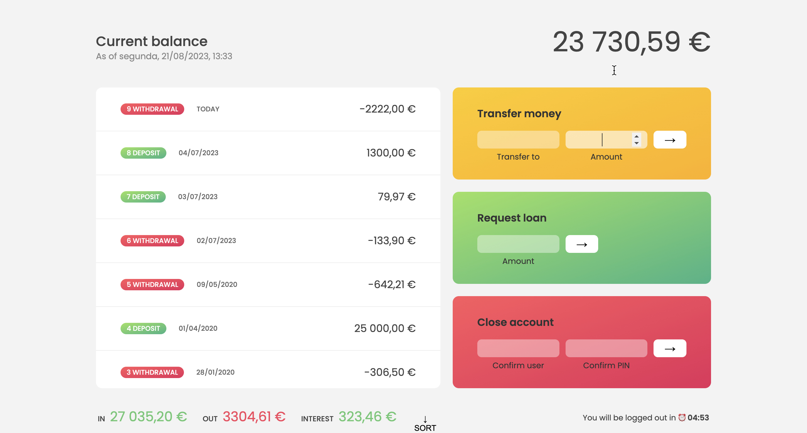

## 🏦 Bankist - Digital Banking Simulation 

View live ：https://easy-bank-js.netlify.app/
Bankist is a digital banking simulation project that allows users to interact with a virtual bank account. Implemented using HTML, CSS, and JavaScript, this application provides an insightful look into modern banking interfaces and functionalities.This project is built while learning Javascript in Udemy.

## 🚀 Features
Login to Accounts: Access predefined bank accounts using unique PINs.
View Transactions: See the list of transactions, including deposits and withdrawals.
Interest Calculation: Interest rates are applied to account balances.
Modern Interface: Utilizes modern web technologies for a sleek and user-friendly design.

## 🎮 How to Access
Username & PIN: Use the following credentials to access the demo accounts:
Username: js
PIN: 1111

Open the App: Open index.html in your preferred browser.

## 💻 Setup and Running
Simply download or clone the repository.
Open index.html in your preferred browser.
No server or additional setup required.
